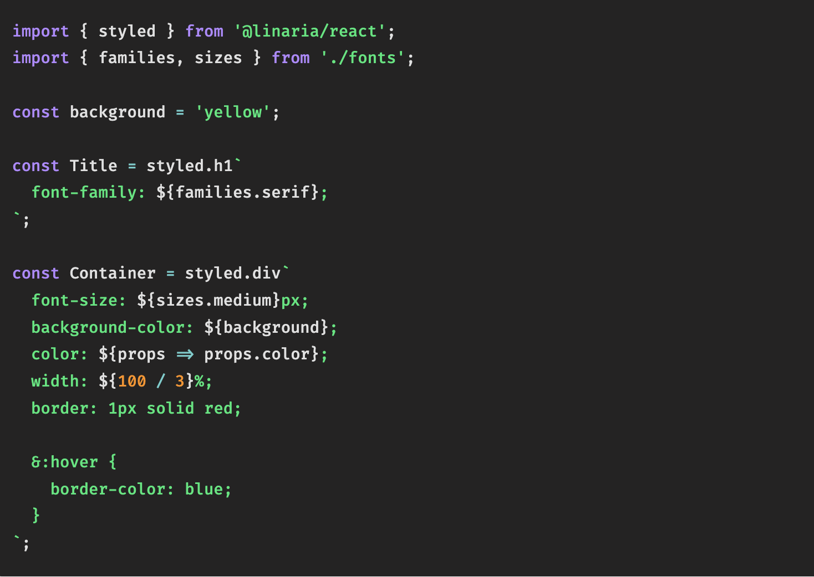
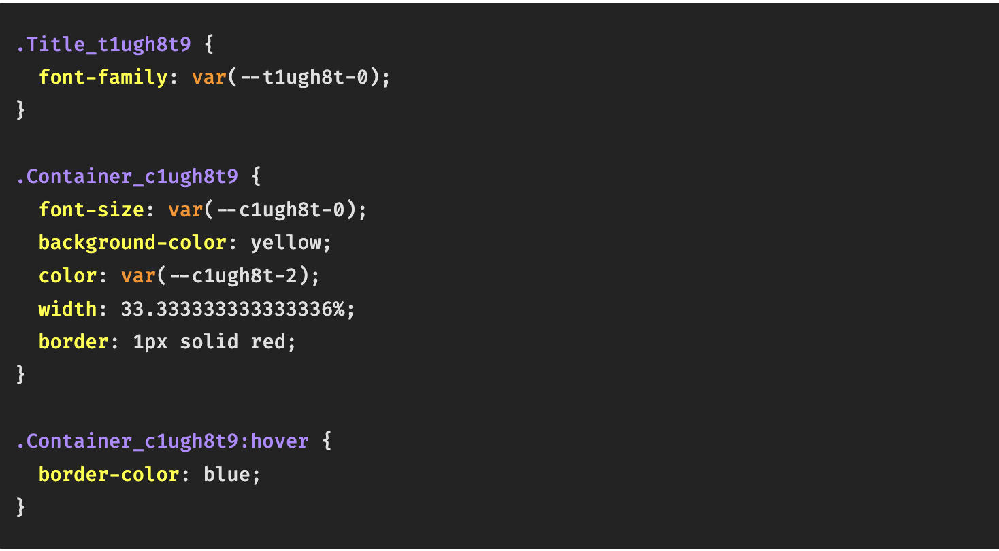

# CSS in JS?

→ 말 그대로 **JS** 코드에서 **CSS**를 작성하는 방식을 의미한다. 2014년 **Facebook** 개발자의 발표에서 소개가 되었으며, 기존 **CSS**관리의 어려움을 해결한 **Facebook**의 사례를 소개하고 있고 이 발표 이후 개념이 발전하면서 많은 라이브러리가 등장했다.

## Zero-Runtime CSS-in-JS

→ **zero-runtime**이란 말 그대로 **runtime**에서 동작이 없다는 것을 뜻한다. 즉 동적으로 스타일을 생성을 하지는 않는다.

→ **Linaria**는 **styled-components**에서 영감을 받아 유사한 **API**를 가진 **CSS-in-JS**라이브러리이고, **zero-runtime**으로 동작을 한다. **babel plugin**과 **webpack loader**를 통해 사용된 **css**코드를 추출해 정적인 스타일시트를 생성을 해준다.



이거는 CSS코드를 빌드하기 전이다.



CSS코드 빌드 후의 코드

## Linaria

→ **zero-runtime**으로 동작하는 **linaria**는 빌드 시 **mini-css-extract-plugin**과 같은 플러그인을 사용하여 **critical css**를 추출한다. **code splitting**을 사용하지 않거나 **initial css chunk**가 초기 로드에 필요한 **css**가 아닐경우 즉, **mini-css-extract-plugin**에 의해 **critical css**를 판단할 수 없는 경우 **linaria**에서 제공하는 **collect**를 사용할 수 있다.

Linaria 예시코드

```jsx
import { collect } from "@linaria/server";

const { critical, other } = collect(html, css);
```

→ **linaria/server** 모듈에서 제공하는 **collect API**는 **HTML**과 **CSS** 문자열을 각각 받아 **CSS**중 실제로 **HTML**에서 사용된 것을 **critical**, 나머지를 **other**로 구분을 해준다. 추출된 **Critical** **CSS**는 주요 렌더링 경로에서 사용하므로 문서 상단에 주입하고, 나머지는 <**link**> 태그로 로드하여 렌더링을 막지 않고 비동기로 로드할 수 있다.
