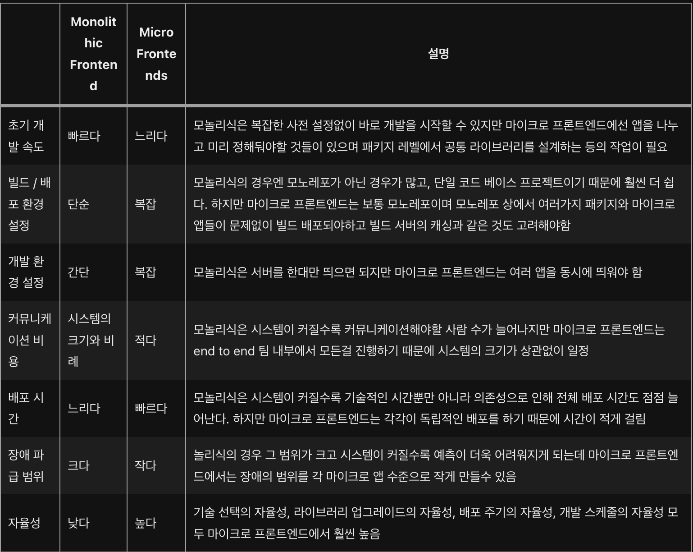

## Micro FE?

<aside>
💡 독립적으로 제공 가능한 프론트엔드 애플리케이션이 더 큰 전체로 구성되는 아키텍처 스타일

</aside>

→ 마이크로 프론트엔드를 적용했다면 독립적으로 제공이 가능해야하고 이렇게 독립적으로 제공된 애플리케이션이 더 큰 전체로 구성되어야 한다.

## VS Monolithic Frontend

## 언제 써야함?

- 규모가 클때
  → 절대적인 수치는 없지만, 문제가 발생하는데 이유를 찾다가 프로젝트의 규모가 크면 큰 것이다.
- 기능적으로 마이크로 앱으로 분해가 가능할 때
  → 서비스가 url 경로를 기준으로 기능적으로 구분이 가능한 경우가 좋으며 어떤 팀이 어떤 부분에 책임을 가지고 있는지가 명확하게 구분이 가능해야한다.
- 런타임에 여러가지 마이크로 앱을 선택적으로 조립해서 제공해야 하는 경우
  → 런타임에 특정 버전을 사용하도록 처리하면 레고처럼 쉽게 블록을 조합하여 제공할 수 있다.
- 마이크로 앱이 독립적으로 인프라 구성이 가능한 경우
  → 같은 서버를 마이크로 앱마다 나눠서 사용하는 것보다 클라우드 자원을 충분히 활용 가능한 경우 사용하는 것이 좋다.

## 장점은?

- 덜 복잡하고, 적은 양의 코드를 관리하여 코드의 품질을 높일 수 있다.
- 배포의 범위가 줄어들어 빌드 및 배포 시간이 줄고 위험도가 줄어든다.
- 단일 장애 지점을 피할 수 있다.
- 점진적으로 업그레이드하기 좋다.
- 요구사항에 맞춰 어플리케이션을 자유롭게 조립하여 제공할 수 있다.
- 독립적으로 개발 및 배포할 수 있기 때문에 오너십을 가진 팀이 자유롭게 스케줄을 조정할 수 있다.
- 팀이 주도적으로 자유롭게 기술 스택을 선택할 수 있다.
- 서로 다른 팀이 독립적으로 작업을 할 수 있기 때문에 개발 주기가 더 빨라질 수 있다.

## 단점은?

- 중복코드가 발생할 수 있다.
- 전체적인 리소스의 크기가 커져 성능 저하에 대한 주의가 필요하다.
- 초기 구축 비용이 든다.
- 다양한 마이크로 프론트엔드 간의 통합과 통신에서 추가적인 복잡성이 발생할 수 있다.
- 빌드 타임에선 문제가 없지만 런타임에서 동적으로 통합하는 과정에서 문제가 발생할 수 있다.
- 일관적인 ux를 제공하기 위한 장치가 필요하다.
- 마이크로 프론트엔드마다 기술적인 격차가 벌어질 수 있다.
