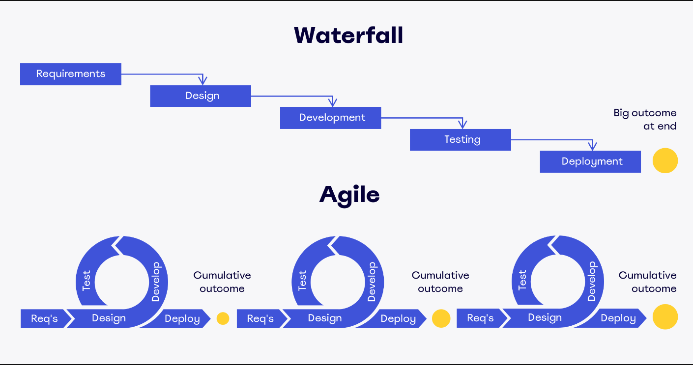

# Waterfall vs Agile

## Waterfall이 뭐임?

<aside>
💡 소프트웨어 개발 방식 중 하나로, 프로젝트를 선형적이고 순차적으로 진행하는 방법론

</aside>

→ 이 방식은 각 단계가 이전 단계의 완료를 전제로 하며, 요구사항 정의(설계), 디자인, 개발, 테스트, 배포의 과정이 순서대로 진행되어 이전 단계과 완료되지 않으면 다음 단계로 진행할 수 없다.

> 워터폴 방식은 주로 요구사항이 명확하고 고정적이며 변경 가능성이 적은 프로젝트에 적합.

## waterfall 방식의 단계별 예시

## 1. 요구사항 정의

> 이 단계에서는 프로젝트의 목적, 범위, 기능, 비기능 요구사항 등을 클라이언트와 협의하여 문서화 한다. 웹 사이트를 개발하는 경우, 웹 사이트의 목표, 대상 사용자, 주요 기능, 디자인 스타일, 보안 요구사항 등을 명확히 정의한다.

## 2. 디자인

> 요구사항에 따라 프로젝트의 구조, 아키텍처, 인터페이스, 데이터베이스 등을 설계한다. 웹 사이트를 개발하는 경우, 웹 사이트의 레이아웃, 색상, 폰트, 메뉴, 버튼 등을 디자인하고, 백엔드 시스템의 구성, 프레임워크 선택, API 정의 등을 수행한다.

## 3. 개발

> 디자인에 따라 실제로 프로젝트를 구현하는 단계이다. 웹 사이트를 개발하는 경우, HTML, CSS, JavaScript 등을 사용하여 프론트엔드를 코딩하고, 백엔드를 구성하기 위해 PHP, Python, Java 등을 사용한다. 이를 통해 디자인된 시스템을 실제로 구현하고 기능을 개발한다.

## 4. 테스트

> 개발된 프로젝트를 검증하고 오류나 결함을 수정하는 단계이다. 웹 사이트를 개발하는 경우, 웹 사이트의 기능이 정상적으로 작동하는지, 사용자 경험이 만족스러운지, 보안 문제가 없는지 등을 테스트한다. 이를 통해 개발된 시스템이 요구사항을 충족하고 오류가 최소화된 상태인지 확인한다.

## 5. 배포

> 테스트를 통과한 프로젝트를 클라이언트에게 전달하고 실제 환경에서 작동하도록 준비하는 단계이다. 웹 사이트를 개발하는 경우, 웹 서버에 웹 사이트를 업로드하고 도메인 이름을 설정하여 공객적으로 접근할 수 있도록 한다. 이를 통해 개발된 시스템이 실제 사용자들에게 제공되며 운영될 수 있다.

## 6. 유지보수

> 배포된 프로젝트를 지속적으로 관리하고 업데이트하며 클라이언트의 피드백을 반영하는 단계이다. 웹 사이트를 개발하는 경우, 웹 사이트의 성능을 모니터링하고 버그를 수정하고 새로운 기능을 추가하며 보안 패치를 적용한다. 이를 통해 프로젝트의 지속적인 개선과 클라이언트의 요구에 대한 대응을 수행한다.

## Waterfall의 장점?

1. 팀에 명확한 방향을 제시하고 기대치를 전달할 수 있다.

   → 워터폴 방식은 초기에 요구사항을 명확히 정의하고 문서화하는 특징이 있다. 이를 통해 프로젝트 팀은 명확한 방향성과 목표를 가지게 된다.

2. 오류를 쉽게 추적하고 비용을 명확하게 책정할 수 있다.

   → 워터폴 방식은 각 단계가 선형적인 흐름을 가지고 있어 새로운 팀원을 프로젝트에 간편하게 통합할 수 있다. 각 단계에서 발생한 오류를 파악하고 수정함으로써 프로젝트의 품질을 향상시킬 수 있다.

3. 새로운 팀원을 간편하게 통합할 수 있다.

   → 워터폴 방식은 각 다계가 선형적인 흐름을 가지고 있어 새로운 팀원을 프로젝트에 간편하게 통합할 수 있다. 새로 합류한 팀원은 이전 단계에서 개발된 문서와 결과물을 기반으로 작업을 시작할 수 있으며, 각 단계가 순차적으로 진행되기 때문에 전체 프로세스를 이해하기 쉽다.

## Waterfall의 단점?

1. 일정이 빠듯하거나 문제가 발생하면 전체 프로젝트에 영향을 줄 수 있다.

   → 워터폴 방식은 단계적으로 진행되기 때문에 이전 단계의 완료가 다음 단계로의 진행을 기다려야 한다. 따라서, 하나의 단계에서 지연이 발생하거나 문제가 발생하면 전체 프로젝트 일정에 영향을 미칠 수 있다.

2. 테스트가 마지막 단계에 진행되므로 복잡하고 시간이 오래 걸릴 수 있다.

   → 워터폴 방식은 테스트 단계를 프로젝트의 마지막에 배치하는 특징이 있다. 이는 개발된 시스템을 테스트하고 검증하는 작업이 뒤로 미뤄지기 때문에, 오류나 결함을 발견하고 수정하는 데에 시간이 오래 걸릴 수 있다.

3. 클라이언트의 변경 요구나 시장 환경의 변화에 유연하게 대응하기 어렵다.

   → 워터폴 방식은 초기에 요구사항을 정의하고 문서화하기 때문에, 프로젝트가 진행되는 동안 클라이언트의 변경 요구나 시장 환경의 변화에 대한 유연한 대응이 어려울 수 있다.

## Agile이 뭐임?

<aside>
💡 작업 계획을 짧은 단위로 세우고 제품을 만들고 고쳐 나가는 사이클을 반복함으로써 고객의 요구 변화에 유연하고도 신속하게 대응하는 개발 방법론이다.

</aside>

→ 좋은 것을 빠르게 취하고, 유연하고 효율적으로 개발을 할 수 있도록 만드는 다양한 방법론을 통칭해 일컫는 말이다.

## Agile 프레임워크

> : 애자일 방법론을 따르는 개발 기법, ex) Scrum, kanban, XP(eXtreme Programming) 등등

## Agile이 왜 중요함?

> 애자일의 탄생 배경에는 워터폴(Waterfall; 폭포수) 방식이 있다.

→ 워터폴에 비해서 기능을 축소하고 그 주기를 짧게하여 빠르게 한 주기가 돌게 한 후 중간 테스트(피드백)을 많이 가지는 방식이다. (한 주기 = 스프린트(sprint))

## Agile의 장점?

1. 개발 과정이 빠르고 유연함
2. 짧고 반복적인 스프린트로 구성 → 빠르게 결함 식별 및 수정가능
3. 소규모 팀들이 여러과제를 각각 할당받아 처리 가능
4. 개발 과정중에 신속하게 제품 변경 가능(짧은 반복과정을 거치기 때문)

## Agile의 단점

1. 빠른 반복 작업에 익숙한 숙련된 사람이 필요
2. 수많은 변경사항이 있을 수 있으므로 번거로움 발생 가능
