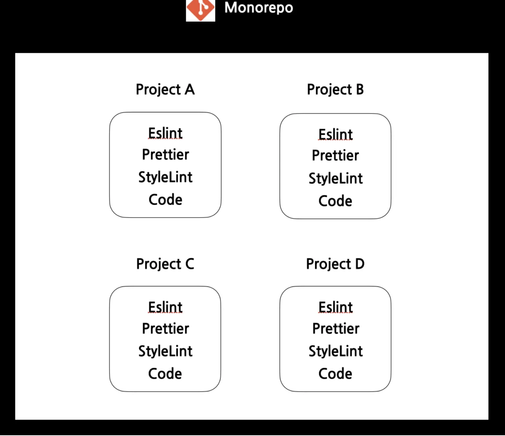

# monorepo?

<aside>
💡 다수의 프로젝트를 한 개의 레포지토리 내에서 관리하는 소프트웨어 개발 전략

</aside>

## 1. 모노레포 도구 선택

→ 모노레포 도입을 위해서는 먼저 도구를 결정해야한다. 모노레포 구조를 도와주는 도구는 여러가지가 있다. 그 중 작가들은 아래와 같은 이유로 yarn berry와 yarn workspace를 선택하게 되었다.

- PnP(Plug’n Play)를 사용하여 라이브러리 간의 중복 의존성 문제, 비효율적인 패키지 설치 문제를 해결
- zero-Install 사용
- yarn사용
-

## 2. 모노레포 구조?

→ 처음에 모노레포를 도입하게 되면 위아 같이 하나의 레포지토리 내에 서로 다른 멀티 레포 프로젝트가 존재하는 형태이다. 이러한 구조에서 우리는 모노레포 구조를 잘 활용하기 위해 각 서비스가 가지고 있는 공통 코드를 분리하고, 코드 패턴을 통일 하는 작업들을 진행할 수 있다.

## 컨벤션?

→ 각 서비스에서 기존에 사용하던 컨벤션들을 취합하고, 공통된 부분과 앞으로 사용할 컨벤션을 모아둔 패키지를 생성한다.

## 폴더 구조 & 아키텍쳐?

→ 프론트엔드에서 사용하는 폴더 구조와 코드의 패턴은 매우 다양하다. 높은 자율성으로 인해 각 서비스의 폴더 구조와 코드 패턴은 담당자에 따라 매우 달라지게 된다.

## page-modules 폴더 구조?

→ 먼저 도메인에 종속되지 않은 폴더는 root 레벨 폴더로 저장을 하고 각 페이지에서 사용되는 폴더는 page-modules 폴더에서 각 도메인 별로 관리될 수 있게 분리를 해준다.

## 패키지 구현?

→ apps = 운영중인 서비스들을 관리하는 폴더

→ libs = 도메인에 종속되지 않고, 다양한 서비스에서 라이브러리 형태로 사용할 수 있는 폴더

→ package = libs 패키지들을 사용해서 더 고도화된 기능을 사용하는 폴더이다.
