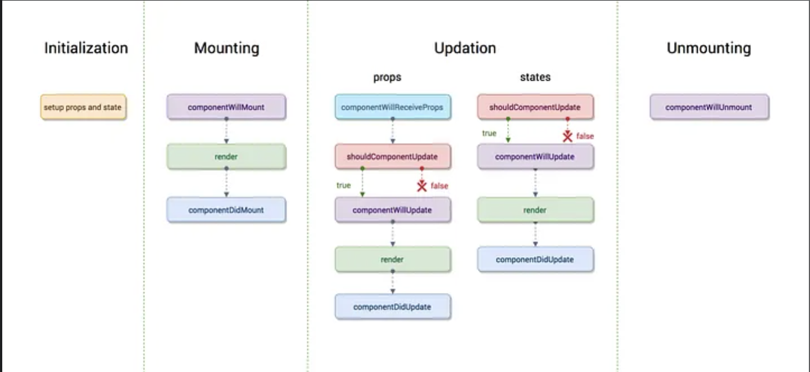

# React Life Cycle

# Life Cycle?

<aside>
💡

컴포넌트가 DOM에 삽입되는 순간부터 제거되는 순간까지의 과정을 말한다.

이 과정은 여러 단계로 나뉘며, 각 단계는 특정 작업을 수행하거나 반응할 수 있는 기회를 제공한다.

</aside>


→ 이 과정은 여러 단계로 나뉘며, 각 단계는 특정 작업을 수행하거나 반응할 수 있는 기회를 제공한다.

# 초기화 단계: Constructor

→ 컴포넌트의 생성자 함수에서 초기 상태를 설정하고, 종종 컴포넌트의 이벤트 핸들러를 바인딩 한다. 이 단계는 컴포넌트의 생명주기에서 단 한번만 발생한다.

```jsx
import React, { Component } from "react";

class ExampleComponent extends Component {
  constructor(props) {
    super(props);
    //초기 상태 설정을 해줌
    this.state = {
      count: 0,
    };
  }

  componentDidMount() {
    console.log("Component did mount");
  }
  render() {
    return (
      <div>
        <p>{this.state.count}</p>
        <button onClick={() => this.setState({ count: this.state.count + 1 })}>
          Increment
        </button>
      </div>
    );
  }
}
```

# 마운팅 단계

→ 컴포넌트가 DOM에 삽입되는 단계이다.

# 업데이트 단계

→ 컴포넌트는 새로운 props를 받거나 setState를 통해 상태가 변경될 때 업데이트 됩니다.

```jsx
componentDidUpdate(prevProps, prevState) {
	if (this.state.count !== prevState.count) {
		console.log('Count state has changed.');
	}
}
```

# 언마운팅 단계

→ 컴포넌트가 DOM에서 제거되는 시점을 얘기한다.

```jsx
componentWillUnmount() {
	console.log('Component will unmount.');
	//이벤트 리스너 제거 등의 정리 작업
}
```

# React Hooks 소개

→ Hooks는 함수형 컴포넌트에서 상태(state)와 React의 기타 기능들을 ‘hook into’할 수 있도록 해준다. 그 중 가장 자주 사용되는 Hooks에는 “useState”, “useEffect”, “useContext”등이 있으며, 이들을 사용하여 클래스 컴포넌트에서 가능했던 대부분의 기능을 구현할 수 있다.

```jsx
import React, { useState } from "react";

function Counter() {
  const [count, setCount] = useState(0);

  return (
    <div>
      <p>You clicked {count} times</p>
      <button onClick={() => setCount(count + 1)}>Click me</button>
    </div>
  );
}
```

→ setCount라는 setter를 통해 업데이트하고 count라는 getter를 통해 가져올 수 있습니다.

# useEffect 생명주기 이벤트

→ useEffect Hook은 앞서 얘기한 클래스 컴포넌트의 componentDidMout, componentDidUpdate, componentWillUnmount 생명주기 메소드의 기능을 합쳐 놓은 것과 유사하다. 이를 사용하여 데이터의 fetching이나 구독, 좋야요 기능 설정 등 그외 부수 효과(side effects)를 처리할 수 있다.

# Hooks의 중요성

→ Hooks의 도입은 함수형 컴포넌트에서도 상태 관리와 생명주기 기능을 간결하게 사용할 수 있게 되면서 React 개발자들을 기존의 클래스 컴포넌트의 복잡성을 피하면서도 모든 기능을 사용할 수 있게 되었다. Hooks는 또한 컴포넌트간 상태 로직의 재사용을 용이하게 만들어, 코드의 유지 보수성과 가독성을 높여주는 장점이 있다.

# 결론

→ React 생명주기 메소드를 활용하면 컴포넌트의 생성, 업데이트, 재거 과정을 효과적으로 관리할 수 있다는 장점이 있다. 이를 통해 성능 최적화를 이룰 수 있으며 React의 생명주기를 이해하고 이를 바탕으로 효과적인 컴포넌트를 설계하는 것이 React 개발의 핵심이다.
